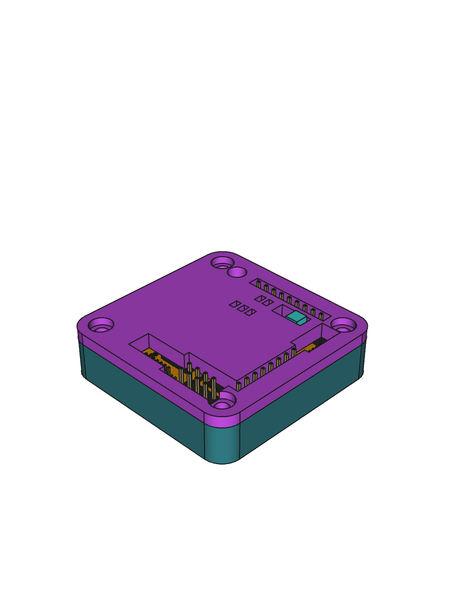
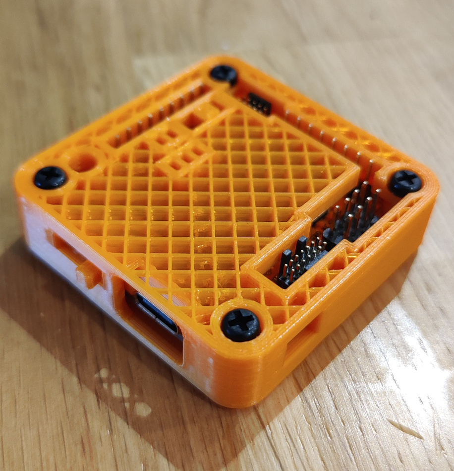
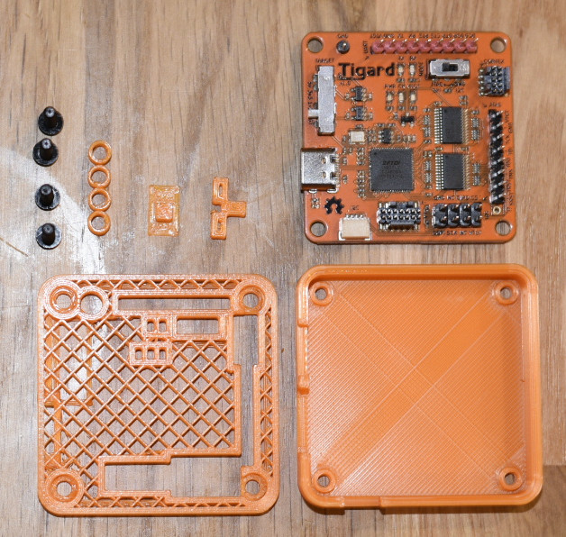

# TigarDen

A 3D printable enclosure for the Tigard Open Source Hardware Hacking Tool from [Securing Hardware](https://securinghardware.com/)

# Enclosure

 

# Assembly Requirements

 

* The enclosure comes in the following parts;
    * [top (STL)](Lid.stl)
    * [bottom (STL)](Base.stl)
    * [shim (STL)](Shim4mm.stl)
    * [voltage switch (STL)](VoltageSwitchNotched.stl)
    * [JTAG/SWD switch (STL)](JTAGSwitch.stl)

AND

* 4x M3x10; The base screw holes are sized for M3 tapping/self tapping (gently)
* 4x non-slip rubber feet for that extra flair (Optional)

OR
* 4x M3x14 Bolts
* 4x M3 Nyloc nuts as feet

# Printing

> Note: I don't recommend printing them all at once, you won't be able to select the top/bottomless grid for the lid this way anyway, this image is to indicate which way up to print. Voltage switch is printed notch-up.

For my print I sliced in Cura and printed at 0.2mm (Standard quality) (on an almost-stock Ender 3 V2), the tolerences in the design should be enough to allow for some variation in print quality.

Print the JTAG switch and base right-way-up, print the voltage switch (note it has a notch) and lid upside down; see below if you want to replicate the grid pattern.

> Note: The dimensions take into account the dimensions when printing without top and bottom layers for the lid, the lid may need adjustments if you choose to print with top and bottom layers on.

For the switches, I recommend printing multiples, spaced out on the print bed, this gives each layer time to cool before the next layer. I've found when printing tiny items like these, that the hotend will melt everything together if it stays over a small print too long, so i came up with this solution.

It means you have a few extras (if they print successfully) but a much higher chance of success in my experience.

# Shims

The shims sit between the Tigard and the lid to hold it firmly in place so there is no play when connecting/disconnecting things to and from the board. The STL is exported at 4mm, these fit perfectly and the lid closes exactly with my print, but you may wish to export them again or modify the Z height in your slicer to adapt them.

# The Grid

If you wish to achieve the grid pattern shown in the photograph, disable top and bottom layers in your slicer, set infill type to "grid" and set your infill density according to the grid size you would like, the photo above is 25% infill.

# Modifying

The FreeCAD design file is [here](TigarDen.FCStd), modify to your hearts desire. I'm a FreeCAD/CAD beginner so I would appreciate any critique of the approach, raise a ticket or ping me on Twitter.

# Open Source Tools/Software

3D CAD model created with [FreeCAD 0.19 AppImage](https://freecadweb.org/) on [Manjaro Linux](https://manjaro.org/), images edited with [GIMP](https://www.gimp.org/), PNGs optimised with [pngcrush](https://pmt.sourceforge.io/pngcrush/), this document written in [VSCodium](https://vscodium.com/), prints sliced using [Ultimaker Cura](https://github.com/Ultimaker/Cura) and printed using [Marlin 2.0.x (3D Printer) Firmware](https://github.com/MarlinFirmware/Marlin).

# Links
* [Tigard Sources and Documentation](https://github.com/tigard-tools/tigard)
* [Tigard at Crowd Supply](https://www.crowdsupply.com/securinghw/tigard)

# License

Tigard is Copyright 2020 Franklin Harding CC BY-SA 4.0.

TigarDen © 2021 by Hamid Elaosta is licensed under CC BY-SA 4.0. To view a copy of this license, visit http://creativecommons.org/licenses/by-sa/4.0/
