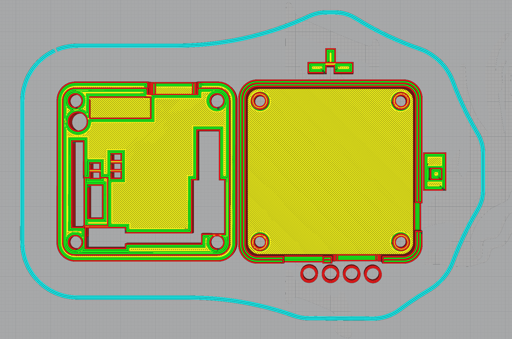

# TigarDen

A 3D printable enclosure for the Tigard Open Source Hardware Hacking Tool from [Securing Hardware](https://securinghardware.com/)

## Links
https://github.com/tigard-tools/tigard

https://www.crowdsupply.com/securinghw/tigard

# Enclosure

# Requirements

* The enclosure comes in 4 parts, [top](Lid.stl), [bottom](Base.stl), [voltage switch](VoltageSwitchNotched.stl) and [JTAG/SWD switch](JTAGSwitch.stl), you'll need the 4 files in this repo for those.
* 4x M3x14 Bolts 
* 4x M3 Nyloc nuts as feet M3x10 as the base screw holes are sized for tapping/self tapping (gently)

# Printing

> Note: I don't recommend printing them all at once, you won't be able to select the top/bottomless grid for the lid this way anyway, this image is to indicate which way up to print. Voltage switch is printed notch-up.

For my print I sliced in Cura and printed at 0.2mm (Standard quality), the tolerences in the design should be enough to allow for some variation in print quality.

Print the JTAG switch and base right-way-up, print the voltage switch (note it has a notch) and lid upside down; see below if you want to replicate the grid pattern.

> Note: The dimensions take into account the dimensions when printing without top and bottom layers for the lid, the lid may need adjustments if you choose to print with top and bottom layers on (FreeCAD file will be in this repo after some clean up).

For the switches, I recommend printing multiples, spaced out on the print bed, this gives each layer time to cool before the next layer. I've found when printing tiny items like these the hotend will melt everything together if it stays over a small print too long, so i came up with this solution. It means you have a few extras (if they print successfully) but a much higher chance of success in my experience.

# The Grid

If you wish to achieve the grid pattern shown in the photograph, disable top and bottom layers in your slicer, set infill type to "grid" and set your infill density according to the grid size you would like (the photo above is 25% infill).

# License

Tigard is Copyright 2020 Franklin Harding CC BY-SA 4.0.

TigarDen © 2021 by Hamid Elaosta is licensed under CC BY-SA 4.0. To view a copy of this license, visit http://creativecommons.org/licenses/by-sa/4.0/
